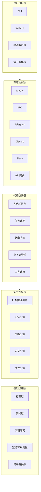
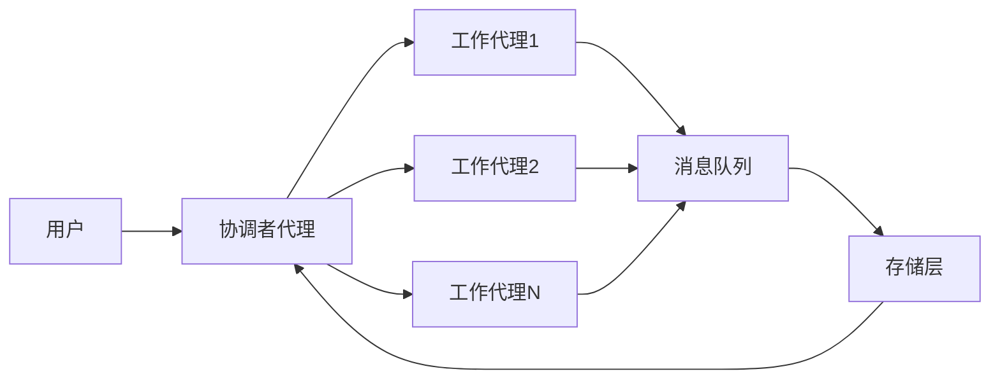
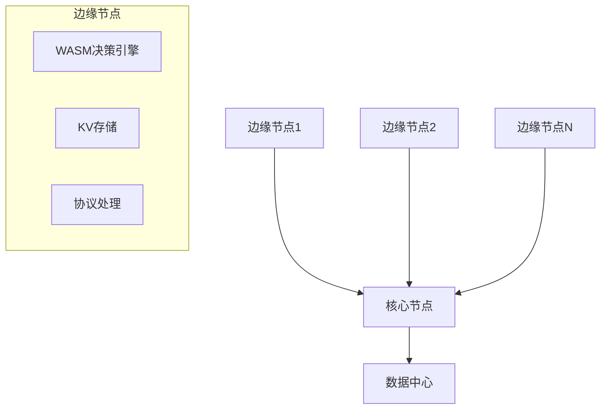
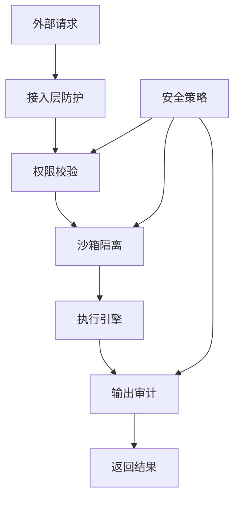

# NullClaw 整体架构说明

## 整体架构图


## 核心设计原则

### 1. 极致轻量化
- 单二进制分发，无外部依赖
- 二进制大小 < 1MB
- 启动时间 < 2ms
- 内存峰值 < 1MB RSS

### 2. 全静态编译
- 使用Zig语言全静态编译
- 支持musl和glibc环境
- 跨平台无缝运行
- 零动态链接库依赖

### 3. VTable驱动架构
所有核心子系统都使用VTable接口抽象：
```zig
pub const Channel = struct {
    ptr: *anyopaque,
    vtable: *const VTable,

    pub const VTable = struct {
        start: fn (*anyopaque) anyerror!void,
        stop: fn (*anyopaque) void,
        send: fn (*anyopaque, Message) anyerror!void,
        name: fn (*anyopaque) []const u8,
    };
};
```

### 4. 分层架构设计
#### 渠道适配层
负责对接各种消息渠道，每个渠道实现统一的VTable接口，上层无需关心底层渠道差异。目前支持18+种主流消息渠道。

#### 代理编排层
核心调度层，负责多代理协作、任务分发、上下文管理、工具调用调度。支持1000+轮工具调用迭代。

#### 能力引擎层
提供核心能力支撑：
- **LLM推理引擎**：支持9+主流AI提供商和40+兼容服务
- **记忆引擎**：分层存储架构，支持8+种存储后端
- **策略引擎**：WASM轻量化决策核心，边缘计算友好
- **安全引擎**：多层安全防护，沙箱隔离，权限控制
- **插件引擎**：动态加载扩展功能，热更新支持

#### 基础设施层
提供底层支撑能力：
- 跨平台抽象层，屏蔽操作系统差异
- 网络协议栈，HTTP/WebSocket/原生TCP支持
- 多种沙箱隔离后端（Landlock、Firejail、Bubblewrap、Docker）
- 可观测性系统，指标、日志、链路追踪
- 存储抽象，支持SQLite、Redis、PostgreSQL等

## 多代理架构


### 代理角色
- **协调者代理**：负责任务分解、分发、结果聚合
- **工作代理**：负责具体任务执行，工具调用
- **专业代理**：特定领域专家，如代码专家、安全专家等

### 通信机制
- 基于Matrix/IRC等消息协议实现跨节点通信
- 支持点对点和广播模式
- 消息持久化和至少一次交付保证
- 端到端加密支持

## 边缘计算架构


### 边缘节点特性
- WASM核心大小 < 100KB
- 本地决策延迟 < 1ms
- 离线运行支持
- 自动缓存热点数据
- 低带宽环境自适应

## 安全架构


### 安全分层
1. **接入层**：速率限制、IP白名单、WAF防护
2. **权限层**：RBAC权限模型、细粒度权限控制
3. **隔离层**：多种沙箱后端、进程隔离、资源限制
4. **审计层**：全操作日志、敏感信息过滤、异常检测

## 部署架构
支持多种部署模式：
- **单节点模式**：单机运行，适合小型场景
- **集群模式**：多节点分布式部署，高可用
- **边缘模式**：边缘+核心混合部署，低延迟
- **Serverless模式**：按需启动，极致弹性
